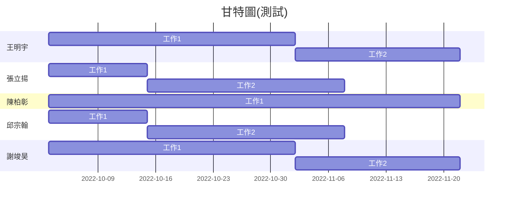

| 職位 | 學號 | 姓名 | 任務 |
| :---: | :---: | :---: | :---: |
| **組長** | C109118119 | [王明宇](https://github.com/yu9131) | - |
| 組員 | C109118113 | [張立揚](https://github.com/st306012) | - |
| 組員 | C109118124 | [陳柏彰](https://github.com/MoRedChen) | - |
| 組員 | C109118152 | [邱宗翰](https://github.com/muzui1115) | - |
| 組員 | C109118155 | [謝竣昊](https://github.com/HaoHsieh) | - |

