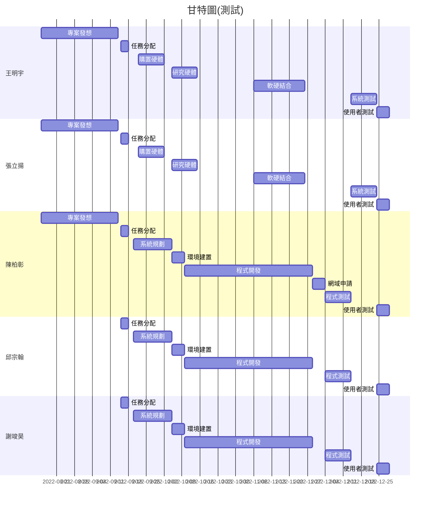
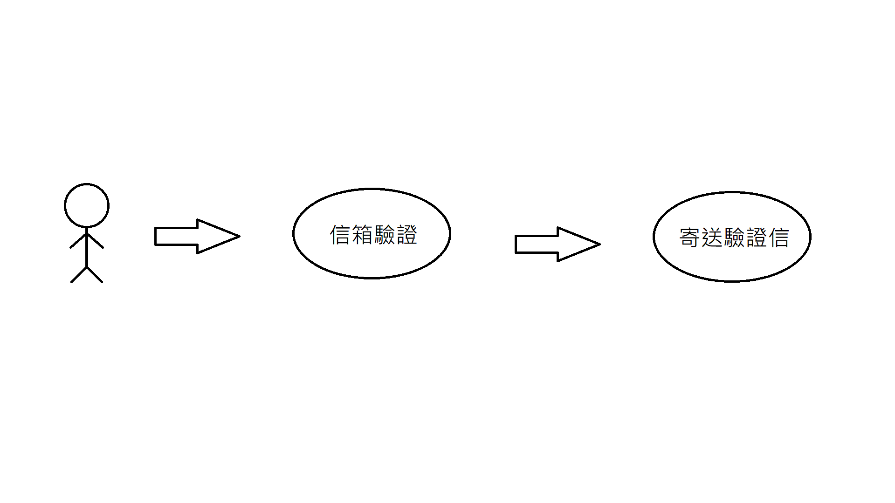

## 組長與組員之姓名及任務
| 職位 | 學號 | 姓名 | 任務 |
| :---: | :---: | :---: | :---: |
| **組長** | C109118119 | [王明宇](https://github.com/yu9131) | - |
| 組員 | C109118113 | [張立揚](https://github.com/st306012) | - |
| 組員 | C109118124 | [陳柏彰](https://github.com/MoRedChen) | - |
| 組員 | C109118152 | [邱宗翰](https://github.com/muzui1115) | - |
| 組員 | C109118155 | [謝竣昊](https://github.com/HaoHsieh) | - |

 

## 甘特圖

 

## PERT/CPM圖

 

## 功能性需求與非功能性需求(至少各三項)
功能性需求：
1. note 1
2. note 2
3. note 3

非功能性需求：
1. note 1
2. note 2
3. note 3

 

## 呈現功能分解圖(functional decomposition diagram, FDD)

 

## 需求分析的文字描述

 

## 使用案例圖
### 忘記密碼：

 

## 使用案例說明(三個以上)
| 使用案例名稱 | 忘記密碼 |
| :-- | :-- |
| 行動者 | 使用者 |
| 說明 | 描述重設密碼之過程 |
| 完成動作 | 1. 點擊忘記密碼 2. 輸入信箱 3. 系統寄送驗證信 4. 點擊連結進行密碼重設 |
| 替代方法 | 1. 點擊忘記密碼 2. 輸入信箱 3. 系統判定信箱尚未註冊 |
| 先決條件 | 已經註冊過 |
| 後置條件 | 認證完畢，可以重設密碼 |
| 假設 | 無 |

| 使用案例名稱 | 案例2 |
| :-- | :-- |
| 行動者 | null |
| 說明 | null |
| 完成動作 | null |
| 替代方法 | null |
| 先決條件 | null |
| 後置條件 | null |
| 假設 | 無 |

| 使用案例名稱 | 案例3 |
| :-- | :-- |
| 行動者 | null |
| 說明 | null |
| 完成動作 | null |
| 替代方法 | null |
| 先決條件 | null |
| 後置條件 | null |
| 假設 | 無 |

 

## Figma使用案例動態模擬畫面
[Figma預覽連結](https://www.figma.com/proto/zs1PjkdDDMe9ZzYtN2oMWd/Untitled?node-id=3%3A2&scaling=scale-down&page-id=0%3A1&starting-point-node-id=3%3A2)

