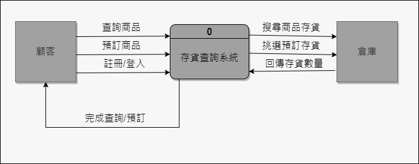

## 組長與組員之姓名及任務
| 職位 | 學號 | 姓名 | 任務 |
| :---: | :---: | :---: | :---: |
| **組長** | C109118119 | [王明宇](https://github.com/yu9131) | 管理專案進度 |
| 組員 | C109118113 | [張立揚](https://github.com/st306012) | 硬體功能開發 |
| 組員 | C109118124 | [陳柏彰](https://github.com/MoRedChen) | 程式編寫 |
| 組員 | C109118152 | [邱宗翰](https://github.com/muzui1115) | 軟硬體結合 |
| 組員 | C109118155 | [謝竣昊](https://github.com/HaoHsieh) | 軟硬體結合 |

 

## 甘特圖

 

## PERT/CPM圖

 

## 功能性需求與非功能性需求
功能性需求：
1. 查詢該店存貨量
2. 查詢附近存貨
3. 會員可預定商品

非功能性需求：
1. 使用性(usability)：導入Google Map，較易上手
2. 維護性(maintainability)：硬體部分占比少，較易維護
3. 可靠度(reliability)：導入Google Map，較穩定

 

## 功能分解圖(functional decomposition diagram, FDD)

 

## 需求分析的文字描述
一個存貨查詢系統的需求分析簡述如下：
1. 使用者可以藉由載入(Load) 貨品清單(Inventory) 資料來產生報表(Inventory Reports)。
2. 使用者可以藉由載入以及儲存貨品資料。
3. 銷售人員(Sales Clerk) 紀錄現場的貨品銷售。
4. 任何銷售必須更新存貨。
5. 如果該店無存貨，將會搜尋附近有存貨之店家。

 

## 使用案例圖

 

## 使用案例說明
| 使用案例名稱 | 忘記密碼 |
| :-- | :-- |
| 行動者 | 使用者 |
| 說明 | 描述重設密碼之過程 |
| 完成動作 | 1. 點擊忘記密碼 2. 輸入信箱 3. 系統寄送驗證信 4. 點擊連結進行密碼重設 |
| 替代方法 | 1. 點擊忘記密碼 2. 輸入信箱 3. 系統判定信箱尚未註冊 |
| 先決條件 | 已經註冊過 |
| 後置條件 | 認證完畢，可以重設密碼 |
| 假設 | 無 |

| 使用案例名稱 | 登入 |
| :-- | :-- |
| 行動者 | 使用者 |
| 說明 | 顧客輸入帳號密碼進入系統 |
| 完成動作 | 1. 點擊信箱欄輸入帳號 2. 點擊密碼欄輸入密碼 3. 點擊登入 4. 進入首頁 |
| 替代方法 | 1. 點擊信箱欄輸入帳號 2. 點擊密碼欄輸入密碼 3. 點擊登入 4. 提示帳號密碼有誤 |
| 先決條件 | 無 |
| 後置條件 | 登入系統成功進行查詢 |
| 假設 | 無 |

| 使用案例名稱 | 存貨查詢 |
| :-- | :-- |
| 行動者 | 使用者 |
| 說明 | 顧客查詢所需商品之存貨 |
| 完成動作 | 1. 點擊查詢存貨 2. 輸入商品名稱 3. 顯示該店庫存數量  |
| 替代方法 | 1. 點擊查詢存貨 2. 輸入商品名稱 3. 該店查無此商品  |
| 先決條件 | 已完成登入系統 |
| 後置條件 | 查詢附近庫存 |
| 假設 | 無 |

 

## Figma使用案例動態模擬畫面
[Figma預覽連結](https://www.figma.com/proto/zs1PjkdDDMe9ZzYtN2oMWd/Untitled?node-id=3%3A2&scaling=scale-down&page-id=0%3A1&starting-point-node-id=3%3A2)

 

## 系統環境圖(DFD)

 

## DFD 圖0

 

## 分鏡板

 
